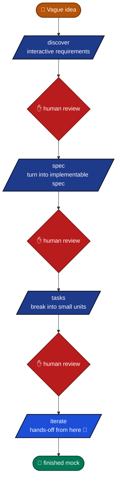
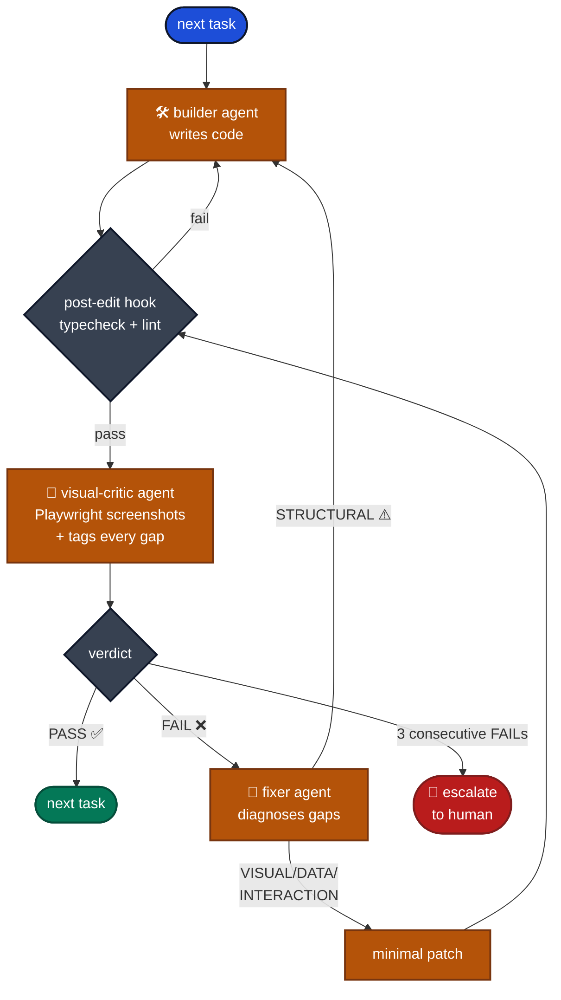

# claude-code-mock-starter

> A GitHub Template for building browser-runnable UI mocks at maximum speed with [Claude Code](https://docs.claude.com/en/docs/claude-code/overview).

**🌐 Language**: English | [日本語](README.ja.md)

The human only describes what they want and reviews the result. Claude Code handles the rest — requirements clarification, design, implementation, visual verification, and self-correction. **No coding experience required.**

---

## ✨ Features

- **Interactive requirements gathering** — the `/discover` command interviews you to turn vague ideas into an implementable spec.
- **Spec-driven workflow** — `REQUIREMENTS → SPEC → TASKS → implementation`, with a human review gate at each step.
- **Visual self-improvement loop** — Playwright MCP screenshots the running mock, AI verifies against the spec, fixes its own gaps.
- **Enforced quality gates** — every file edit triggers a hook that runs `tsc` and `eslint`. Failures force the AI to self-correct.
- **Cross-platform** — macOS / Linux / Windows (WSL2 recommended).
- **Fixed stack for reproducibility** — Vite + React + TypeScript + Tailwind + shadcn/ui + MSW + React Router. No bikeshedding.
- **Quality bar tuned for client-facing proposals** — the visual-critic tags gaps by category (`[VISUAL] [DATA] [INTERACTION] [STRUCTURAL]`) and the fixer escalates structural mismatches back to the builder for proper rebuild instead of taping over them.

---

## 🚀 Quick Start

### 0. Prerequisites
You only need two things, even as a non-developer.

#### Required

| Tool | Install |
|--|--|
| **Claude Code** (native) | macOS / Linux / WSL: `curl -fsSL https://claude.ai/install.sh \| bash`<br>Windows (PowerShell): `irm https://claude.ai/install.ps1 \| iex`<br>Homebrew: `brew install --cask claude-code`<br>Official docs: <https://docs.claude.com/en/docs/claude-code/quickstart> |
| **Node.js 24+** | Official installer: <https://nodejs.org/en/download> (pick latest LTS)<br>Required because the template uses React/Vite. |

> 💡 Claude Code itself used to require Node.js, but the **native installer** is now the official recommended path. Node.js is only needed for the React app build.

#### Optional

| Nice to have | Use case |
|--|--|
| **Git** (<https://git-scm.com/downloads>) | Only if you want version control. The "Download ZIP" path below works without Git. |

After installing, verify in a terminal (macOS Terminal app, Windows PowerShell, or WSL2 shell):
```bash
claude --version
node -v       # → v24.0.0 or higher
```

### 1. Get the template
Pick whichever fits you.

**Option A (easiest, no Git needed)**: Download ZIP
1. Open <https://github.com/nukacha/claude-code-mock-starter>
2. Click the green "**Code**" button → "**Download ZIP**"
3. Unzip wherever you like
4. `cd path/to/claude-code-mock-starter-main` in your terminal

**Option B (recommended for managing as your own repo)**: Use this template (requires GitHub account)
1. Open <https://github.com/nukacha/claude-code-mock-starter>
2. Click "**Use this template**" → "Create a new repository" → name it
3. Clone your new repo (requires Git):
   ```bash
   git clone https://github.com/<your-username>/<your-repo>.git
   cd <your-repo>
   ```

**Option C (one command)**: degit (requires Node.js, no Git)
```bash
npx degit nukacha/claude-code-mock-starter my-mock
cd my-mock
```

### 2. Install dependencies
Inside the project folder:
```bash
npm install
npm run msw:init
```
First install takes a few minutes. If you hit errors, double-check `node -v` is 24+.

### 3. Install Chromium for Playwright (required)
The AI uses Playwright to screenshot the running mock and check its own work. Playwright needs a real browser binary, so download Chromium first:
```bash
npx -y playwright@latest install chromium
```
First run downloads a few hundred MB; expect a few minutes.

**Linux / WSL2 users also need system libraries**:
```bash
sudo npx -y playwright@latest install-deps chromium
```
Enter your machine login password if prompted. Not needed on macOS / native Windows.

> 💡 **You do NOT need to run `claude mcp add playwright ...`.** This template embeds the Playwright MCP server definition directly inside the [visual-critic agent](.claude/agents/visual-critic.md), so it spins up automatically when needed and shuts down when the agent finishes. The first time you run `/iterate` (or `/review`), Claude Code will show a security prompt asking you to approve the embedded server — click approve once and you're done.
>
> Browser cache location: macOS `~/Library/Caches/ms-playwright/`, Linux/WSL `~/.cache/ms-playwright/`, Windows `%USERPROFILE%\AppData\Local\ms-playwright\`

### 4. Launch Claude Code
From the project folder:
```bash
claude
```
The interactive session opens in your terminal.

### 5. Build a mock in 4 steps
Inside the Claude Code session, just run these slash commands in order:
```
/discover    # 1. AI interviews you → REQUIREMENTS doc
/spec        # 2. AI converts requirements → SPEC
/tasks       # 3. AI breaks SPEC into implementation tasks
/iterate        # 4. AI builds → reviews → fixes autonomously (hands-off)
```
Between each step, Claude asks "ready to proceed?" — read the doc and approve if it looks right.

After the loop finishes, open a separate terminal and run:
```bash
npm run dev
```
Visit the URL it prints (usually http://127.0.0.1:5173) in your browser to see the finished mock.

If you want to change something, the easiest path is **`/refine`** — see the next section.

---

## 🔁 When you're not happy with the result: `/refine`

`/refine` takes natural-language feedback and figures out the smallest possible change to address it. **It will not regenerate everything from scratch** — it patches only the parts that need to change, so you don't lose your existing work.

```
/refine make the dashboard chart a line chart instead of bars
/refine add a search box on the products page
/refine the whole thing feels too corporate, make it more casual
```

It auto-detects the depth of your feedback and runs the minimum needed:

| Depth | What `/refine` does | Examples |
|--|--|--|
| **SURFACE** | Edits 1–3 source files. Runs the visual-critic on affected pages. **No doc changes.** | "make the button bigger", "fix the typo in the header", "change card color to blue" |
| **TARGETED** | Surgically updates the affected SPEC section + the affected TASKS entry. Runs builder→critic→fixer on just that one task. | "add a search box on the dashboard", "show product price in the card", "add a settings page" |
| **STRUCTURAL** | Updates REQUIREMENTS.md surgically and asks how you want to propagate it (re-run `/spec`, surgical multi-section update, or just save for later). | "change target users from B2B to consumer", "make the whole thing dark-themed" |

**Why this matters**: re-running the full `/discover → /spec → /tasks → /iterate` pipeline for every small change wastes time and risks the AI re-deciding things you already approved. `/refine` keeps the work you already have.

If `/refine` chooses the wrong depth, just tell it: "no, this is a bigger change than that" — it'll re-classify.

### When NOT to use `/refine`
- **Brand new screens that don't fit existing requirements** → use `/discover` to update REQUIREMENTS first, then continue
- **You want to throw it all away and start over** → delete `docs/REQUIREMENTS.md`, `docs/SPEC.md`, `docs/TASKS.md` and run `/discover` from scratch
- **A pure conversational tweak that's faster to just ask for** → just talk to Claude Code directly without any command. `/refine` is for when you want the change tracked through the doc/task system.

---

## ⚡ Tip: fully hands-off `/iterate`

`/iterate` makes the AI edit files and run `npm` commands autonomously, but by default Claude Code asks for permission on each operation. **If you want to walk away while the loop runs**, launch Claude Code in "skip permissions" mode:

```bash
claude --dangerously-skip-permissions
```

In this mode, no confirmation prompts appear and `/iterate` runs fully hands-off — useful when you want to grab coffee or sleep while the mock builds itself.

### ⚠️ Before you use it
- **It is named "dangerous" for a reason.** You lose the chance to stop a runaway agent.
- This template's [.claude/settings.json](.claude/settings.json) blocks destructive commands like `rm -rf` and `git push --force`, but other risks remain.
- **Safe to use when**:
  - Edits are scoped to `src/` (as in this template) and you have Git history to roll back
  - You're on your local machine with no external systems exposed
- **Don't use when**:
  - You're working in a folder containing important files
  - You're connected to production or shared infrastructure
  - You haven't yet seen how the AI behaves (try a few normal-mode runs first)

### Tips for safe use
1. Run `/iterate` in normal mode the first few times to observe the AI's behavior
2. Once you're comfortable and committing to Git regularly, try `--dangerously-skip-permissions`
3. You can always hit `Ctrl+C` to stop the loop at any time

---

## 🪟 For Windows users

We strongly recommend running inside **WSL2** (Windows Subsystem for Linux 2). Claude Code and Playwright MCP are most stable there, and the hook scripts behave identically to macOS/Linux.

**WSL2 setup**: <https://learn.microsoft.com/en-us/windows/wsl/install>

Inside an Ubuntu shell on WSL2:
```bash
# Install Node.js 24 (nvm recommended)
curl -o- https://raw.githubusercontent.com/nvm-sh/nvm/v0.40.1/install.sh | bash
# Reopen the terminal, then:
nvm install 24
nvm use 24
node -v   # → v24.x.x
```
From there, follow the Quick Start above.

---

## 🔄 How the self-improvement loop works

### Overall flow
The human only reviews at the three ✋ points. Everything after `/iterate` runs hands-off.



### Inside `/iterate`


After 3 consecutive failures on the same task, the loop escalates to the human.

### Why split builder and fixer?
The fixer exists to give a fresh-context agent the job of diagnosing gaps from the visual-critic, instead of asking the builder to defend its own implementation. For client-facing proposal mocks where quality matters, this:
- Removes sunk-cost bias from the diagnosis
- Keeps the per-task retry counter clean
- Lets the fixer make minimal, targeted patches
- **Refuses to patch structurally wrong implementations** — the fixer escalates `[STRUCTURAL]` gaps back to the builder for a proper rebuild instead of layering tape over a broken approach

---

## 📁 Directory layout

```
.
├── CLAUDE.md                # project-wide rules for Claude Code
├── README.md                # this file
├── README.ja.md             # Japanese version
├── docs/
│   ├── REQUIREMENTS.template.md
│   ├── SPEC.template.md
│   └── TASKS.template.md
├── src/
│   ├── App.tsx              # router
│   ├── main.tsx             # entry, boots MSW
│   ├── pages/               # one file per route
│   ├── components/ui/       # shadcn/ui-style primitives
│   ├── components/          # composite components
│   ├── mocks/handlers.ts    # MSW handlers (all APIs)
│   └── lib/utils.ts         # cn() and other tiny helpers
└── .claude/
    ├── settings.json        # hooks / permissions
    ├── commands/            # /discover /spec /tasks /iterate /review
    ├── agents/              # builder / visual-critic / fixer / planner
    ├── hooks/               # cross-platform Node hooks
    └── skills/              # on-demand pattern references
```

---

## ❓ Troubleshooting

| Symptom | Fix |
|--|--|
| `command not found: node` / `npm` | Node.js not installed. Get it from <https://nodejs.org/en/download> (LTS) |
| `command not found: claude` | Claude Code not installed. `curl -fsSL https://claude.ai/install.sh \| bash` (macOS/Linux/WSL) or `irm https://claude.ai/install.ps1 \| iex` (Windows) |
| `npm install` errors | Confirm `node -v` is `v24+`. Update Node.js if older |
| `/iterate` says "Playwright MCP not found" | The MCP server is embedded in the visual-critic agent. Check that you approved the security prompt the first time you ran `/iterate`. You can re-trigger it by running `claude mcp reset-project-choices` and then re-running `/iterate` |
| Linux/WSL `chromium` error (`error while loading shared libraries`) | Run `sudo npx playwright install-deps chromium` |
| Browser shows nothing | Confirm `npm run dev` is running and the URL (http://127.0.0.1:5173) is correct |
| Doesn't work on Windows | Use WSL2 (see the Windows section above) |

When in doubt, just tell Claude Code "I got this error: …" — it'll usually walk you through the fix.

---

## 🛠 npm scripts

| Script | What it does |
|--|--|
| `npm run dev` | Vite dev server (port 5173) |
| `npm run build` | TypeScript build + Vite production build |
| `npm run typecheck` | `tsc -b --noEmit` |
| `npm run lint` | ESLint |
| `npm run test` | Vitest |

---

## 🤝 References
- [shanraisshan/claude-code-best-practice](https://github.com/shanraisshan/claude-code-best-practice)
- [affaan-m/everything-claude-code](https://github.com/affaan-m/everything-claude-code)
- [github/spec-kit](https://github.com/github/spec-kit)
- [Playwright MCP](https://github.com/microsoft/playwright-mcp)

---

## 📄 License
MIT
