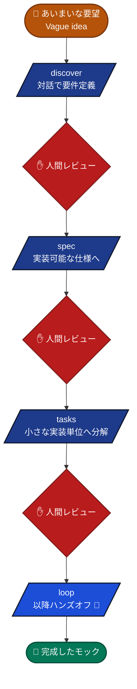
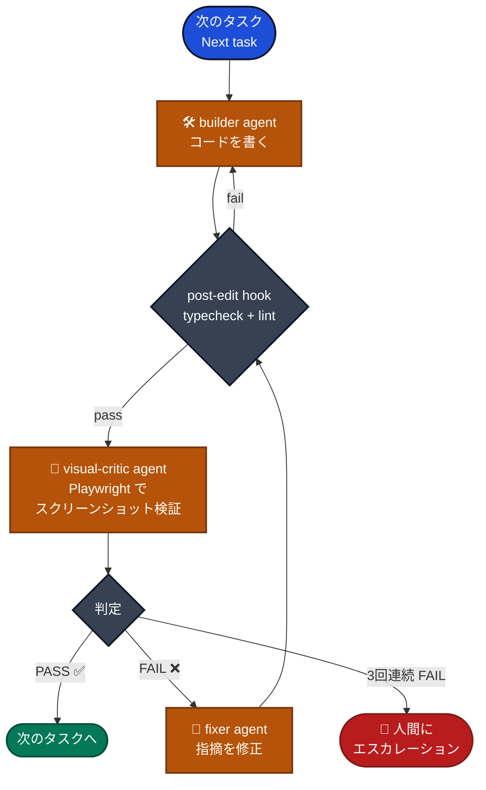

# claude-code-mock-starter

> Claude Code で最速にブラウザで動くUIモックを作るためのGitHub Template
> A GitHub Template for building browser-runnable UI mocks at maximum speed with Claude Code.

人間は **「こんなものが欲しい」と話すこと** と **最終レビュー** だけ。残り（要件整理・設計・実装・視覚検証・修正）はClaude Codeが自走します。
**プログラミングの知識がなくても大丈夫** — AIが対話で要件をまとめ、コードを書き、ブラウザで自分で確認して直してくれます。

The human only describes what they want and reviews the result. Claude Code handles the rest — requirements clarification, design, implementation, visual verification, and self-correction. **No coding experience required.**

---

## ✨ 特徴 / Features

- **対話的な要件定義** — `/discover` コマンドがインタビュー形式であいまいな要望を実装可能な仕様に落とし込みます。
- **Spec-Driven Workflow** — `REQUIREMENTS → SPEC → TASKS → 実装` の各段階で人間がレビュー可能。
- **視覚的な自己改善ループ** — Playwright MCP でスクリーンショットを撮り、AI自身が要件と照合・修正します。
- **強制品質ゲート** — ファイル編集ごとに `tsc` と `eslint` がhookで自動実行され、失敗するとAIが自己修正します。
- **クロスプラットフォーム** — macOS / Linux / Windows (WSL2推奨)。
- **固定スタック** — 再現性のため Vite + React + TypeScript + Tailwind + shadcn/ui + MSW + React Router で固定。

---

## 🚀 クイックスタート / Quick Start

### 0. 事前準備 / Prerequisites
非エンジニアの方も以下2つを入れれば動かせます。

#### 必須 / Required

| 必要なもの | インストール方法 / Install |
|--|--|
| **Claude Code** (ネイティブ版) | macOS / Linux / WSL: `curl -fsSL https://claude.ai/install.sh \| bash`<br>Windows (PowerShell): `irm https://claude.ai/install.ps1 \| iex`<br>Homebrew: `brew install --cask claude-code`<br>公式手順: <https://docs.claude.com/ja/docs/claude-code/quickstart> |
| **Node.js 24 以上** | 公式インストーラー: <https://nodejs.org/ja/download>（最新 LTS を選択）<br>※ このテンプレートが React/Vite を使うため必要です |

> 💡 以前は Claude Code 自体も Node.js 経由でインストールしていましたが、現在は **ネイティブ版**が公式の推奨方法です。Node.js は React アプリのビルドにのみ必要になります。

#### 任意 / Optional

| あると便利 | 用途 |
|--|--|
| **Git** (<https://git-scm.com/downloads>) | バージョン管理したい場合のみ。後述の「ZIP ダウンロード」で進めるならなくてもOK |

インストール後、ターミナル（macOS は「ターミナル」アプリ、Windows は「PowerShell」または WSL2 のシェル）で次を実行して確認:
```bash
claude --version
node -v       # → v24.0.0 以上が出ればOK
```

### 1. テンプレートを取得 / Get the template
3つの方法から好きなものを選んでください。

**方法A（最も簡単・Git不要）**: ZIP をダウンロード
1. <https://github.com/nukacha/claude-code-mock-starter> を開く
2. 緑色の "**Code**" ボタン → "**Download ZIP**" をクリック
3. ダウンロードしたZIPを好きな場所に展開
4. ターミナルで展開したフォルダに移動: `cd path/to/claude-code-mock-starter-main`

**方法B（おすすめ・自分のリポジトリとして管理したい人向け）**: Use this template (要 GitHub アカウント)
1. <https://github.com/nukacha/claude-code-mock-starter> を開く
2. 緑色の "**Use this template**" → "Create a new repository" → リポジトリ名を入力して作成
3. 作ったリポジトリを自分のPCに取得（Git が必要）:
   ```bash
   git clone https://github.com/<あなたのGitHubユーザー名>/<新しいリポジトリ名>.git
   cd <新しいリポジトリ名>
   ```

**方法C（コマンド一発）**: degit (要 Node.js、Git不要)
```bash
npx degit nukacha/claude-code-mock-starter my-mock
cd my-mock
```

### 2. 依存関係のインストール / Install dependencies
プロジェクトのフォルダに入った状態で:
```bash
npm install
npm run msw:init
```
初回は数分かかります。エラーが出た場合は Node.js のバージョン (`node -v`) が 24 以上か確認してください。

### 3. Playwright MCP のセットアップ（必須） / Set up Playwright MCP (required)
AIが「ブラウザでスクリーンショットを撮って自分で確認する」ための仕組みです。視覚的自己改善ループの中核なので必須。

#### 3-1. ブラウザ（Chromium）をインストール
Playwright は実際のブラウザを動かすため、最初に Chromium をダウンロードします。
```bash
npx -y playwright@latest install chromium
```
初回は数百MBのダウンロードがあるので数分かかります。

**Linux / WSL2 ユーザーは追加で**（システムライブラリが必要なため）:
```bash
sudo npx -y playwright@latest install-deps chromium
```
パスワードを聞かれたら PC のログインパスワードを入力してください。macOS / Windows ネイティブでは不要です。

#### 3-2. Claude Code に Playwright MCP を登録
```bash
claude mcp add playwright npx @playwright/mcp@latest -- --headless
```
※ `--headless` を付けることで「画面を表示せず裏でブラウザを動かす」モードになります。WSL2 や画面なしのサーバーでも安定して動かすために推奨です。画面付きで動作を見たい場合は `--headless` を外してください。

#### 3-3. インストール確認
新しいターミナルで `claude` を起動し、対話画面で次を実行:
```
/mcp
```
一覧に `playwright` が `connected` として表示されればOKです。
表示されない場合はターミナルを開き直してから再度試してください。

#### 💡 補足
- 1回設定すれば保存されるので、次回以降このステップは不要です。
- ブラウザのダウンロード先: macOS は `~/Library/Caches/ms-playwright/`、Linux/WSL は `~/.cache/ms-playwright/`、Windows は `%USERPROFILE%\AppData\Local\ms-playwright\`

### 4. Claude Code を起動 / Launch Claude Code
プロジェクトのフォルダで:
```bash
claude
```
ターミナル内に対話画面が立ち上がります。

### 5. 4ステップでモック完成 / Build a mock in 4 steps
Claude Code の対話画面で、以下を順番に入力します。`/` で始まるコマンドを打つだけ。
```
/discover    # 1. AIが質問してくるので答えるだけ → 要件定義書ができる
/spec        # 2. AIが要件を仕様書に変換
/tasks       # 3. AIが仕様書を実装タスクに分解
/loop        # 4. AIが自分で実装→確認→修正を繰り返す（手放しでOK）
```
それぞれの間に「この内容で進めて良いですか？」と確認されます。中身を読んで問題なければ次へ進めてください。

ループ完了後、別のターミナルウィンドウで以下を実行するとブラウザで完成したモックを確認できます:
```bash
npm run dev
```
表示されたURL（通常は http://127.0.0.1:5173 ）をブラウザで開いてください。

修正したい点があれば、Claude Code の画面で `/discover` を再実行するか、要望を直接話しかければOKです。

---

## ⚡ 補足: `/loop` を完全に手放しで動かしたい場合 / Tip: fully hands-off `/loop`

`/loop` は AI が自動でファイル編集や `npm` コマンドを実行しますが、デフォルトでは操作のたびに「このコマンドを実行してよいですか？」と確認を求められます。**席を離れている間にAIが止まってしまうのが嫌な場合**は、Claude Code を「権限スキップモード」で起動できます。

```bash
claude --dangerously-skip-permissions
```

このモードで起動すると、確認プロンプトが出ずに `/loop` が完全に手放しで進みます。コーヒーを淹れている間や寝ている間にモックを完成させたい時に便利です。

### ⚠️ 使う前に知っておくこと
- **名前の通り「危険」なオプション**です。AIが暴走した場合に止める機会がなくなります。
- このテンプレートでは [.claude/settings.json](.claude/settings.json) で `rm -rf` や `git push --force` などの破壊的コマンドを禁止していますが、それ以外のリスクは残ります。
- **使ってよい場面**:
  - このテンプレートのように、ファイル変更が `src/` 以下に限定されていて、Git でいつでも巻き戻せる状況
  - 手元のマシンで動かしていて、外部システムへの影響がない時
- **使うべきでない場面**:
  - 大事なファイルがあるフォルダで作業している時
  - 本番環境や共有サーバーに繋がっている時
  - 何が起きてるか確認したい時（最初の数回は通常モードで動かして挙動を理解してから）

### 安全に使うコツ
1. 最初の数回は **通常モード** で `/loop` を回して、AIがどんな動きをするか観察する
2. 慣れてきて、結果を Git でこまめにコミットしている状態なら `--dangerously-skip-permissions` を試す
3. 何かおかしいと感じたら `Ctrl+C` でいつでも止められます

---

## 🪟 Windows ユーザーへ / For Windows users

WSL2（Windows Subsystem for Linux 2）の上で動かすことを強くおすすめします。Claude Code と Playwright MCP の動作が安定し、トラブルが少ないためです。

**WSL2 のセットアップ**: <https://learn.microsoft.com/ja-jp/windows/wsl/install>

WSL2 を入れた後、Ubuntu のターミナルで:
```bash
# Node.js 24 をインストール（nvm 経由がおすすめ）
curl -o- https://raw.githubusercontent.com/nvm-sh/nvm/v0.40.1/install.sh | bash
# 一度ターミナルを開き直してから:
nvm install 24
nvm use 24
node -v   # → v24.x.x が出ればOK
```
以降は上記クイックスタートと同じ手順です。

---

## 🔄 自己改善ループの仕組み / How the self-improvement loop works

### 全体フロー / Overall flow
人間がレビューするのは ✋ の3箇所だけ。それ以降の `/loop` は手放しで動きます。



### `/loop` の中で起きていること / Inside the loop


3回連続で FAIL すると人間にエスカレーションします。
After 3 consecutive failures on the same task, the loop escalates to the human.

---

## 📁 ディレクトリ構成 / Directory layout

```
.
├── CLAUDE.md                # Claude Code 全体ルール
├── README.md                # このファイル
├── docs/
│   ├── REQUIREMENTS.template.md
│   ├── SPEC.template.md
│   └── TASKS.template.md
├── src/
│   ├── App.tsx              # ルーティング
│   ├── main.tsx             # MSW起動含むエントリ
│   ├── pages/               # 1ファイル = 1画面
│   ├── components/ui/       # shadcn/ui スタイルの基本部品
│   ├── components/          # 自作コンポーネント
│   ├── mocks/handlers.ts    # MSWハンドラ (全API)
│   └── lib/utils.ts         # cn() などの小さなユーティリティ
└── .claude/
    ├── settings.json        # hooks / 権限設定
    ├── commands/            # /discover /spec /tasks /loop /review
    ├── agents/              # builder / visual-critic / fixer / planner
    ├── hooks/               # cross-platform Node hooks
    └── skills/              # on-demand パターン集
```

---

## ❓ よくあるトラブル / Troubleshooting

| 症状 | 対処 |
|--|--|
| `command not found: node` / `npm` | Node.js が入っていません。<https://nodejs.org/ja/download> から LTS 版をインストール |
| `command not found: claude` | Claude Code が未インストール。`curl -fsSL https://claude.ai/install.sh \| bash`（macOS/Linux/WSL）または `irm https://claude.ai/install.ps1 \| iex`（Windows） |
| `npm install` でエラー | `node -v` が `v24` 以上か確認。古ければ Node.js を更新 |
| `/loop` で「Playwright MCP が見つからない」 | 手順3を実行したか確認。Claude Code 内で `/mcp` と入力して `playwright` が `connected` か確認 |
| Linux/WSL で `chromium` 起動エラー (`error while loading shared libraries`) | `sudo npx playwright install-deps chromium` を実行してシステムライブラリを入れる |
| WSL でブラウザが画面に出ない / 固まる | 手順3-2 の `--headless` フラグが付いているか確認 |
| ブラウザに何も表示されない | ターミナルで `npm run dev` が動いているか、URL (http://127.0.0.1:5173) が正しいか確認 |
| Windows でうまく動かない | WSL2 上で実行することを強く推奨（上記セクション参照） |

困ったら Claude Code に「○○というエラーが出た」と話しかければ、ほとんどの場合解決方法を教えてくれます。

---

## 🛠 利用可能なnpmスクリプト / Scripts

| Script | What it does |
|--|--|
| `npm run dev` | Vite dev server (port 5173) |
| `npm run build` | TypeScript build + Vite production build |
| `npm run typecheck` | `tsc -b --noEmit` |
| `npm run lint` | ESLint |
| `npm run test` | Vitest |

---

## 🤝 参考 / References
- [shanraisshan/claude-code-best-practice](https://github.com/shanraisshan/claude-code-best-practice)
- [affaan-m/everything-claude-code](https://github.com/affaan-m/everything-claude-code)
- [github/spec-kit](https://github.com/github/spec-kit)
- [Playwright MCP](https://github.com/microsoft/playwright-mcp)

---

## 📄 License
MIT
